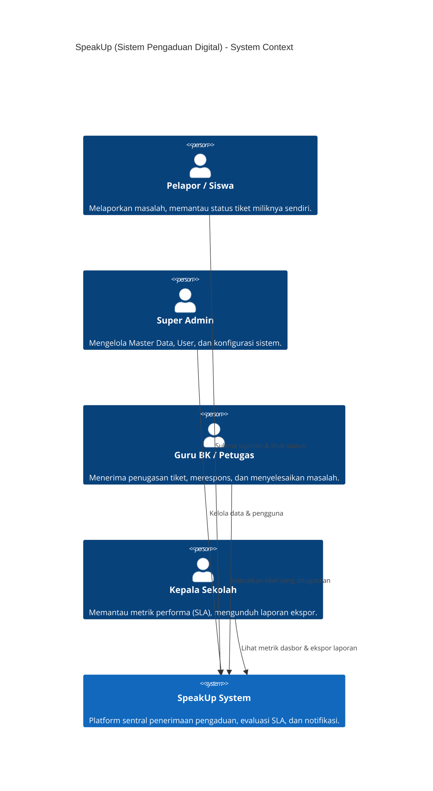
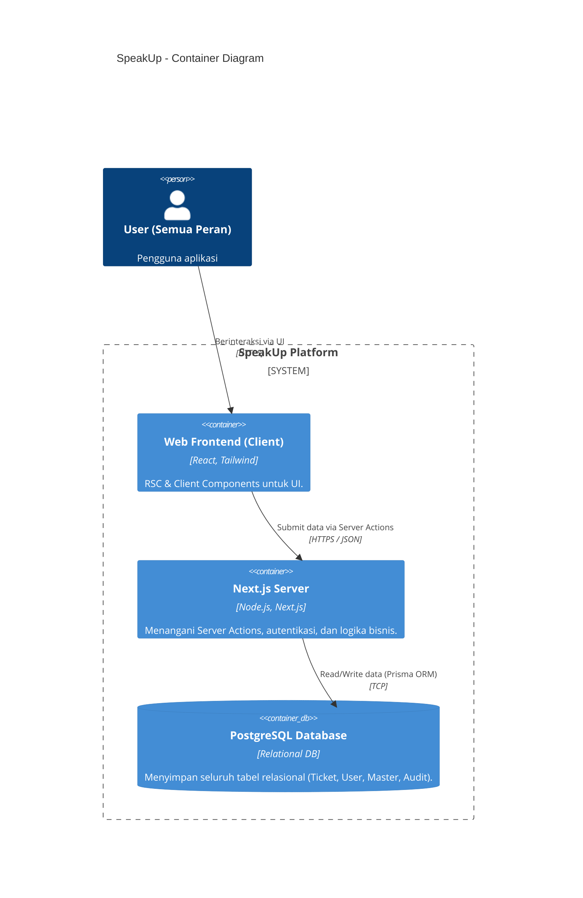
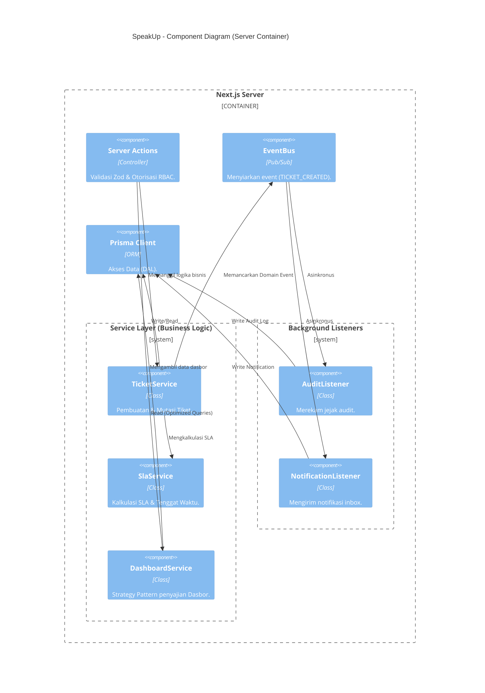

# 02. C4 Model (Context, Container, Component, Deployment)

Diagram arsitektur menggunakan standar C4 Model untuk memberikan berbagai tingkat abstraksi (*zoom level*) dari sistem SpeakUp. Semua diagram dirender menggunakan `mermaid-c4`.

## Level 1: System Context Diagram
*Pandangan tingkat atas (*helicopter view*) yang menunjukkan interaksi aktor-aktor dengan sistem.*



---

## Level 2: Container Diagram
*Membedah sistem menjadi kontainer fungsional (Aplikasi, Database).*



---

## Level 3: Component Diagram (Next.js Server)
*Membedah kontainer Server menjadi blok-blok penyusun internal.*



---

## Deployment View
*Peta arsitektur bagaimana sistem dideploy ke environment Production.*

```mermaid
graph TD
  User((Browser/User))
  Cloudflare[Cloudflare (DNS, CDN, SSL)]
  Nginx[Nginx Reverse Proxy]
  
  subgraph Docker Environment (VM)
    Next[Next.js App Container]
    PG[(PostgreSQL 15 Container)]
    Uploads[Local Storage Volume]
  end

  User -- HTTPS --> Cloudflare
  Cloudflare -- HTTPS --> Nginx
  Nginx -- HTTP (3000) --> Next
  Next -- TCP (5432) --> PG
  Next -- File I/O --> Uploads
```
