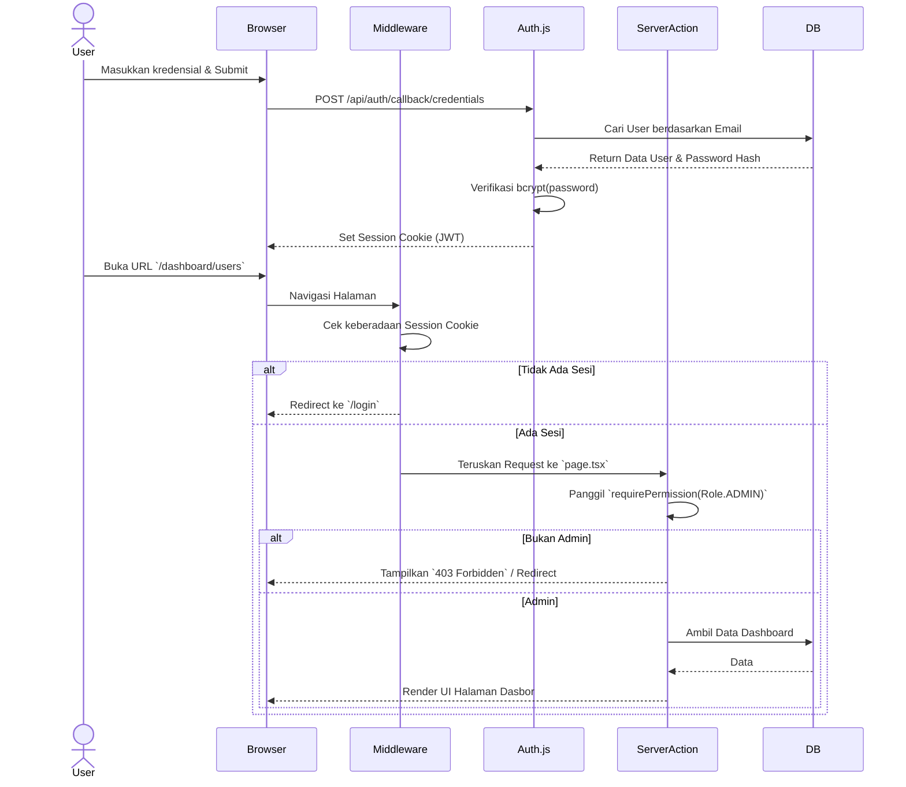
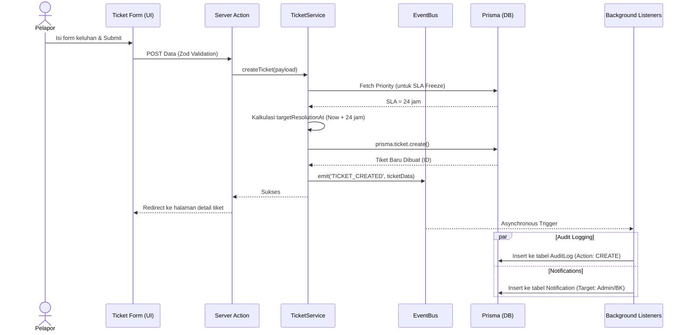
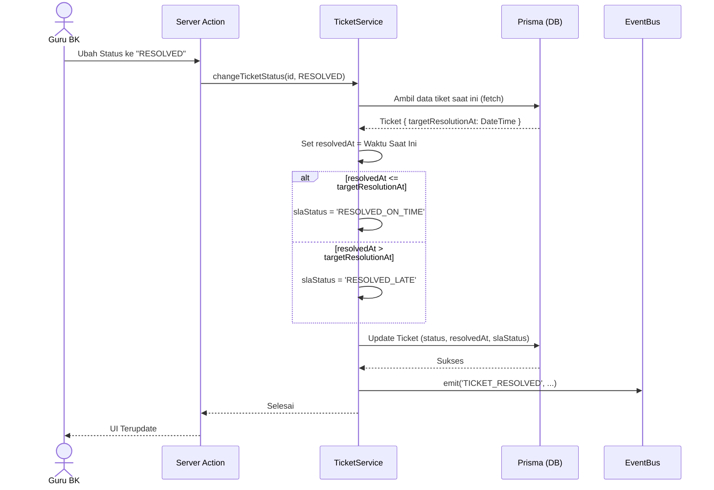

# 03. Sequence Diagrams

Dokumen ini memvisualisasikan urutan pemanggilan metode dan aliran data (*flow*) untuk proses-proses inti aplikasi.

## 1. Authentication & RBAC Flow
*Alur bagaimana pengguna masuk, sesinya dikelola, dan hak aksesnya diverifikasi.*

---

## 2. Ticket Creation & Event Propagation
*Alur ketika Pelapor membuat tiket baru, memicu sistem SLA dan penyebaran notifikasi latar belakang.*

---

## 3. SLA Evaluation Flow (Ticket Resolution)
*Alur ketika Guru BK/Admin menyelesaikan tiket, sistem mengevaluasi apakah penyelesaian tepat waktu atau terlambat.*

