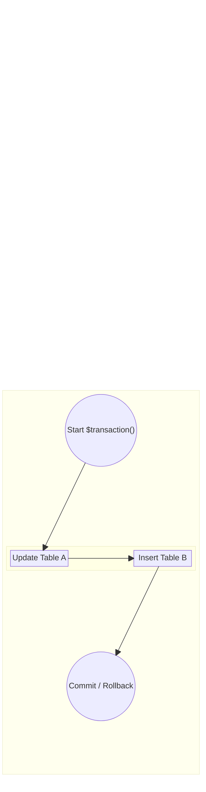
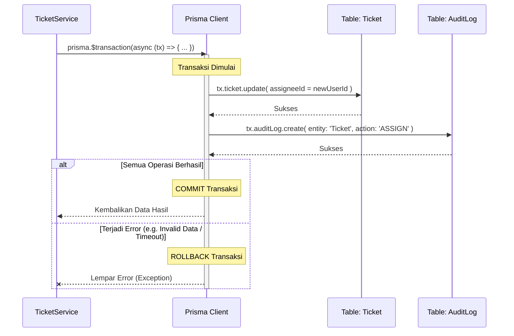

# 04. Transaction Boundaries

Dokumen ini memetakan batasan eksekusi database (*Transaction Boundary*) untuk memastikan integritas data. Konsep inti di SpeakUp adalah memastikan setiap mutasi data yang melibatkan lebih dari satu operasi (misal: *Update Ticket* + *Insert Audit Log*) dieksekusi dalam satu *Transaction Wrapper*. Jika salah satu operasi gagal, seluruh operasi akan dibatalkan (*Rollback*).

## Konsep `prisma.$transaction`

## Contoh Nyata: Alur Penugasan Tiket (Assignment)

Ketika Admin menugaskan sebuah tiket kepada Guru BK, terjadi beberapa mutasi di database. Keseluruhan proses ini **wajib** dikurung dalam satu transaksi agar tidak terjadi data inkonsisten (misalnya tiket sudah berpindah nama petugas, tetapi log tidak tercatat).

### Pedoman Penggunaan Transaksi di SpeakUp:
1. **Dilarang di UI/Server Actions**: Transaksi hanya boleh dipanggil dan dikelola di dalam layar `Service` (contoh: `ticket.service.ts`). Server Actions tidak boleh tahu apakah ada `$transaction` atau tidak.
2. **Ketergantungan Eksternal**: Jangan masukkan panggilan API eksternal (misalnya mengirim email) ke dalam blok `$transaction`, karena ini akan menahan koneksi database terlalu lama (kunci baris / *row locks*). Kirim email melalui *EventBus* **setelah** transaksi berhasil di-*commit*.
