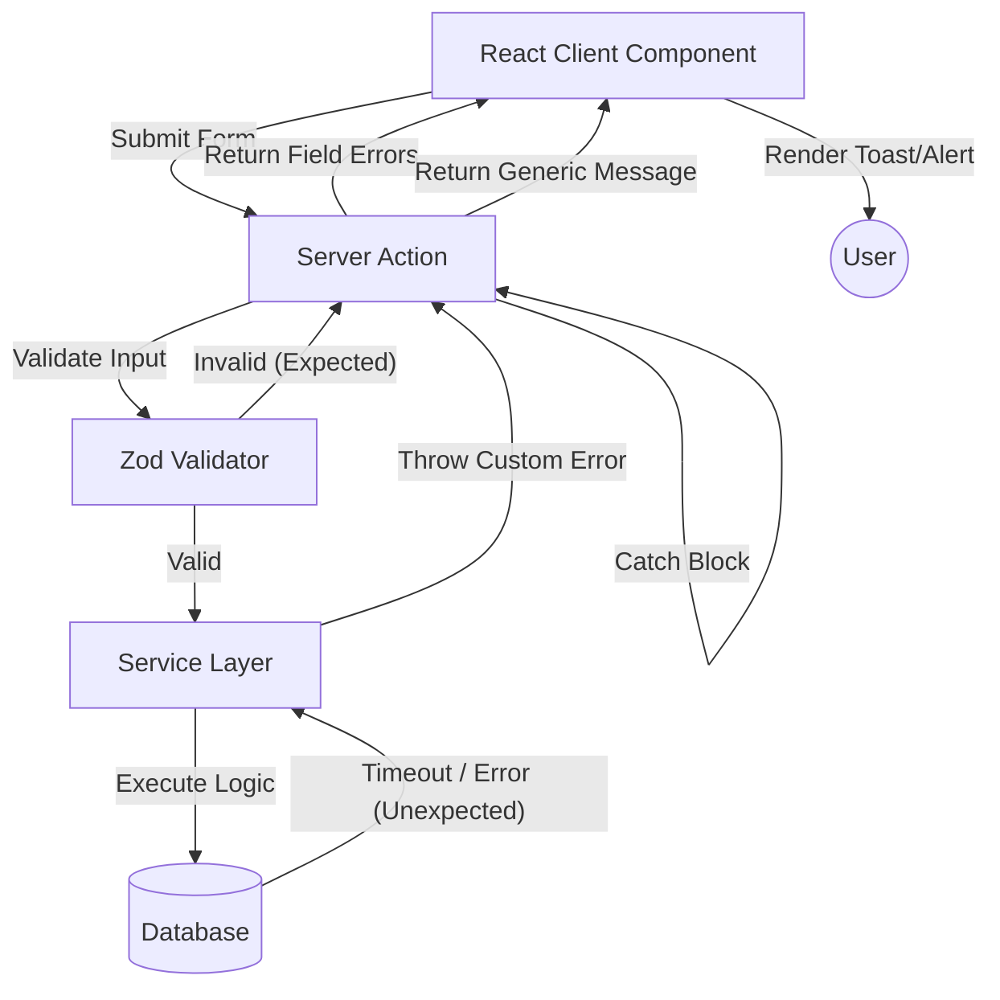

# 05. Error Flows & Handling

Penanganan kesalahan (*Error Handling*) di SpeakUp v1.0 dikonsep untuk menjamin keamanan (tidak membocorkan detail *stack trace* database ke *client*) dan memberikan umpan balik (*feedback*) yang jelas kepada pengguna.

## Konsep Penanganan Error Global

Sistem membedakan antara **Expected Errors** (seperti validasi *form* atau kesalahan otorisasi) dan **Unexpected Errors** (seperti *database connection timeout*).

### 1. Zod Validation Errors (Expected)
- Ditangani langsung di dalam **Server Actions**.
- Mengembalikan objek dengan struktur `{ success: false, errors: FieldErrors }`.
- Ditampilkan di bawah masing-masing kolom input di sisi klien (*Client UI*).

### 2. Business Logic Errors (Expected)
- Terjadi ketika aturan bisnis dilanggar (misalnya mencoba menghapus tiket yang tidak ada, atau menetapkan tiket padahal Anda bukan Admin).
- *Service Layer* akan memunculkan *exception* kustom atau mengembalikan struktur kegagalan (tergantung implementasi spesifik, biasanya *throw new Error("Pesan Ramah Pengguna")*).
- Server Actions akan menangkap (*catch*) error ini dan meneruskan "Pesan Ramah Pengguna" ke komponen klien untuk ditampilkan sebagai *Toast Notification*.

### 3. Database / System Errors (Unexpected)
- Jika Prisma gagal mengeksekusi *query* karena sistem *down* atau *constraint violation* yang tidak terduga, Prisma memunculkan `PrismaClientKnownRequestError`.
- Error ini ditangkap oleh blok *try-catch* Server Action.
- **Aturan Emas**: Pesan kesalahan *raw* dari database **dilarang keras** dikirimkan ke UI. Server Action harus menenggelamkan (*swallow*) pesan error aslinya (misalnya men-log-nya ke konsol server) dan mengirimkan pesan generik ke klien: `"Terjadi kesalahan pada server. Silakan coba lagi nanti."`
