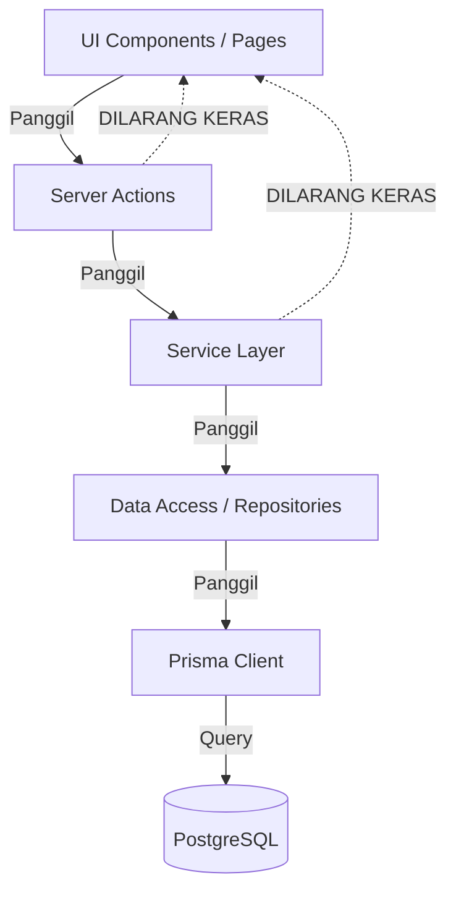
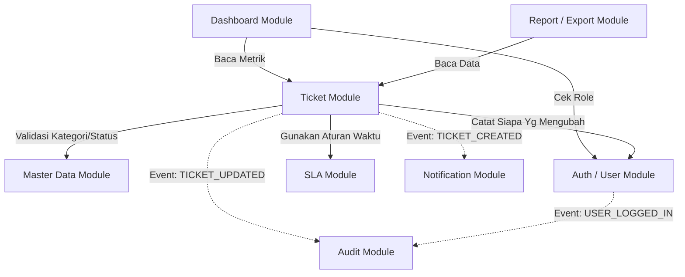

# 06. Module Dependencies

Untuk menghindari kode spageti (*spaghetti code*) dan mencegah *circular dependencies*, SpeakUp menerapkan aturan arah ketergantungan modul (*Dependency Direction Rule*) yang sangat ketat.

## 📋 Module Dependency Rules (Checklist Code Review)

Gunakan checklist ini saat melakukan *Code Review* pada *Pull Request*:

- `✓` **UI ➡️ Server Action**: Komponen UI dipicu via *Server Actions*.
- `✓` **Server Action ➡️ Service Layer**: Logika dipanggil melalui *Service Layer*.
- `✓` **Service Layer ➡️ Prisma**: Akses database terisolasi di *Service/Repository Layer*.
- `✓` **Dashboard ➡️ Ticket**: Dasbor membaca metrik dari tiket.
- `✓` **Report ➡️ Ticket**: Laporan diekstrak dari tiket.
- `✗` **UI ➡️ Prisma**: Dilarang keras query database langsung dari file `.tsx`.
- `✗` **Dashboard ➡️ Notification**: Dasbor tidak boleh memanggil modul notifikasi langsung.
- `✗` **Master Data ➡️ Ticket**: Modul Master Data dilarang mengimpor `TicketService` (bebas dependensi siklik).

---

## 1. Dependensi Lapisan Teknis (Technical Layers)

Ketergantungan struktural **selalu berjalan satu arah** dari luar ke dalam (sesuai prinsip *Clean Architecture*):

**Penjelasan:**
- **UI Components** tidak boleh tahu tentang keberadaan Prisma atau melakukan koneksi database langsung.
- **Service Layer** tidak tahu cara data dirender di UI. Ia murni mengelola logika, menghitung angka (seperti SLA), dan memverifikasi *Business Rules*.

---

## 2. Dependensi Domain Bisnis (Domain Modules)

Dalam sistem monolit modular SpeakUp, kita memiliki berbagai domain bisnis. Ketergantungan antar domain harus dikelola agar satu domain tidak menjadi terikat erat (*tightly coupled*) secara siklik dengan domain lain.

**Penjelasan Utama:**
1. **Pusat Domain (Core Domain)**: `Ticket` dan `Master Data` adalah inti. Modul ini tidak bergantung pada fitur-fitur seperti `Dashboard` atau `Report`.
2. **Ketergantungan yang Diinversikan (Loose Coupling)**: `Ticket` **tidak memanggil** `AuditService` atau `NotificationService` secara langsung saat sebuah tiket dibuat. Jika itu dilakukan, maka `Ticket` akan sangat bergantung pada implementasi teknis fitur sekunder tersebut. Sebaliknya, `Ticket` melempar kejadian (*Event*) ke `EventBus`, yang kemudian didengarkan oleh modul `Audit` dan `Notif`.
3. **Penyimpangan Hierarki Dilarang**: `Master Data` tidak boleh bergantung pada modul `Ticket`. Fungsi `Master Data` murni memberikan daftar kategori/prioritas. Evaluasi perlindungan hapus data (*Deactivation Guard*) ditangani melalui pemeriksaan *database constraint* atau *service orchestrator* yang netral.

