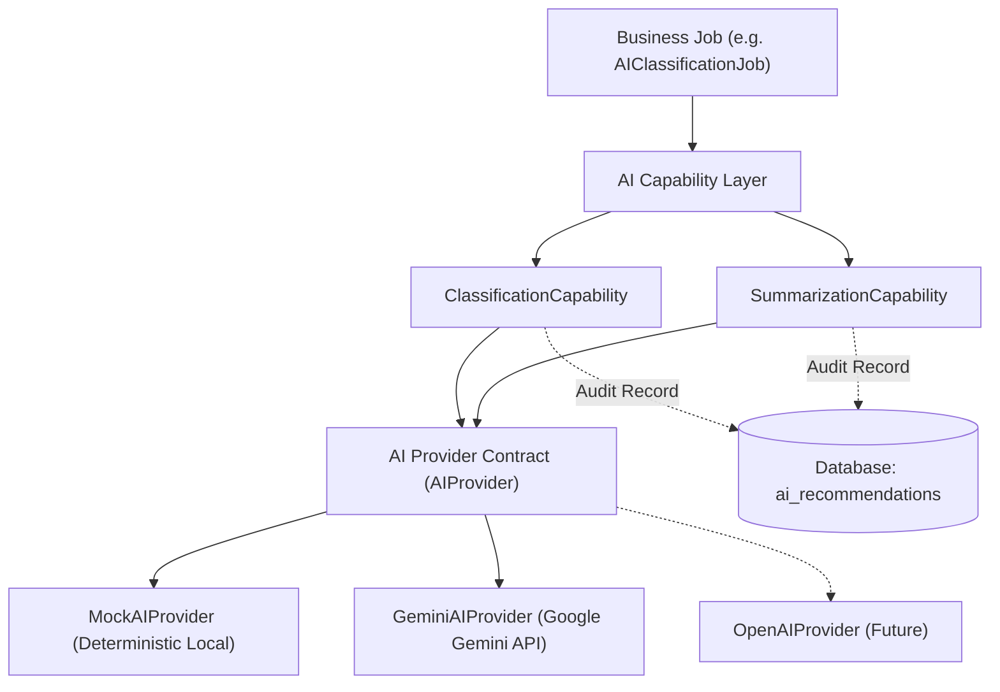

# AI Capability Layer Architecture Specification

Dokumen ini mendeskripsikan spesifikasi arsitektur **AI Capability Layer** pada SpeakUp. Arsitektur 3 lapis ini mengisolasi logika *Business Jobs* dari vendor/model kecerdasan buatan (LLM).

---

## 🏛️ Arsitektur 3 Lapis (3-Tier AI Stack)

---

## 🛡️ Prinsip Isolasi 3 Lapis

1. **Business Job (`BackgroundJob`)**:
   - Hanya mengetahui *kode job* dan pemanggilan ke `AI Capability Layer`.
   - Tidak mengetahui vendor AI (Gemini vs OpenAI) maupun struktur prompt mentah.

2. **AI Capability Layer**:
   - Memformat *system prompt* bisnis dan mengurai respons JSON.
   - Menghasilkan *reasoning* (mematuhi **ADR-007 Prinsip 4: Explainability**).
   - Mencatat draf rekomendasi ke tabel `ai_recommendations` berstatus `PENDING` (mematuhi **ADR-007 Prinsip 3: Auditability**).

3. **AI Provider Contract (`AIProvider`)**:
   - Kontrak *low-level* yang murni melakukan eksekusi inferensi mentah ke model LLM.
   - Tidak mengetahui siapa *Business Job* yang meminta layanan atau untuk entitas apa.

---

## 📊 Skema Tabel `ai_recommendations`

Seluruh hasil masukan AI dicatat secara transparan di database:

| Kolom | Tipe | Deskripsi |
|---|---|---|
| `id` | UUID | Identitas unik rekomendasi |
| `ticketId` | UUID (FK) | Relasi ke tiket terkait |
| `capability` | Enum | `CLASSIFICATION`, `SUMMARIZATION`, `TREND_ANALYSIS` |
| `modelName` | String | Nama model (misal: `gemini-1.5-flash`, `mock-v1.0`) |
| `promptVersion` | String | Versi prompt yang digunakan (`v1.0`) |
| `confidenceScore` | Float | Skor keyakinan model (0.0 - 1.0) |
| `recommendationData` | Json | Objek rekomendasi mentah (kategori, prioritas, ringkasan, reasoning) |
| `userAction` | Enum | `PENDING`, `ACCEPTED`, `REJECTED`, `OVERRIDDEN` |
| `actionReason` | Text | Catatan/alasan tindakan pengguna manusia |
