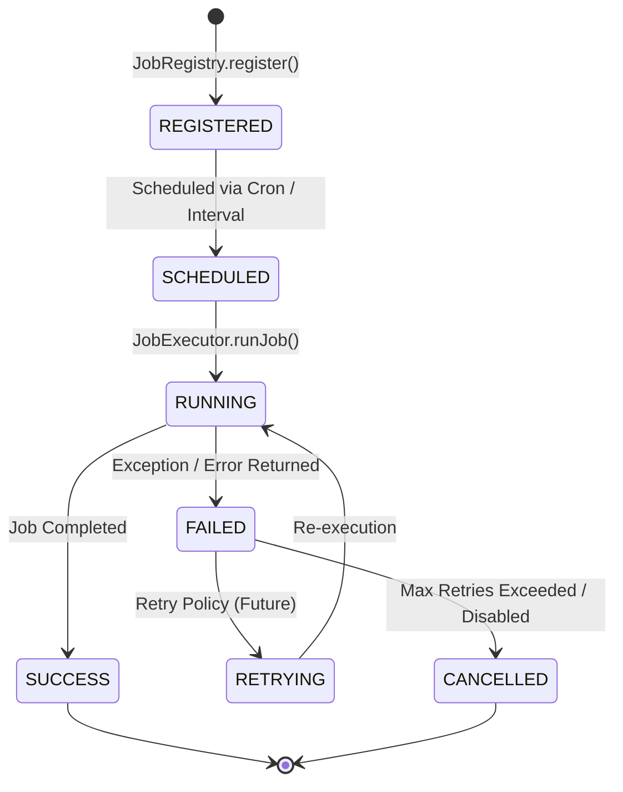
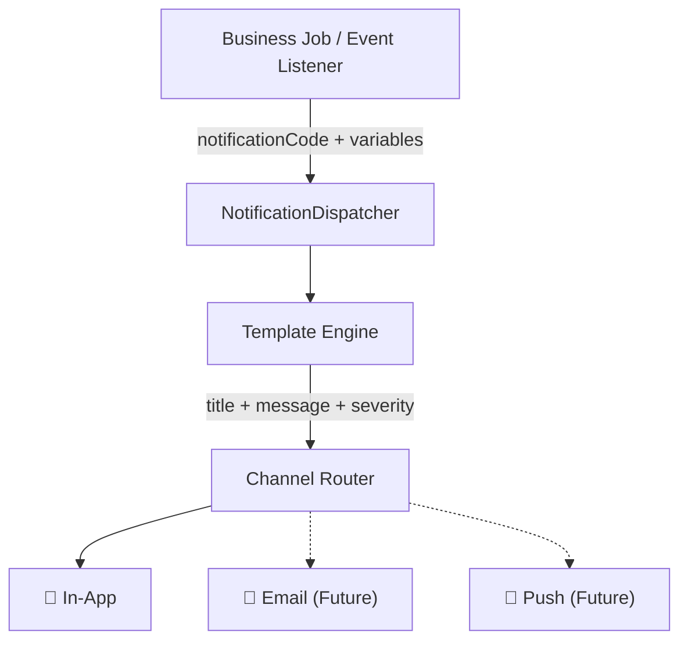

# Background Job Platform & Lifecycle Specification

Dokumen ini mendeskripsikan siklus hidup (*lifecycle*), jaminan platform (*platform guarantees*), serta klasifikasi pekerjaan latar belakang (*background jobs*) pada platform runtime SpeakUp.

---

## 🛡️ Platform Guarantees (Kontrak Platform)

Platform *Background Job* SpeakUp menjamin aturan dasar berikut untuk setiap eksekusi:

1. **Every Job is Logged**: Setiap eksekusi job (baik `SUCCESS` maupun `FAILED`) wajib dicatat di tabel `job_execution_logs`.
2. **Execution Duration Measurement**: Setiap eksekusi mengukur durasi bersih (*durationMs*).
3. **Scheduler Never Executes Inactive Jobs**: `SchedulerService` tidak akan pernah mengeksekusi job yang memiliki flag `isActive = false` di `job_configurations`.
4. **JobExecutor as Single Gateway**: Eksekusi job wajib melalui `JobExecutor.runJob()`. Logika job tidak boleh memicu dirinya sendiri secara langsung.
5. **Centralized Registration**: Seluruh job didaftarkan di satu tempat (`JobRegistry` via `instrumentation.ts`).

---

## 🔄 Job Lifecycle State Machine

Setiap *Background Job* melalui siklus hidup state machine berikut:

---

## 🏷️ Klasifikasi Job (Job Classification)

Platform membedakan pekerjaan menjadi dua kategori utama:

### 1. System Jobs
Pekerjaan pemeliharaan internal platform yang menjaga kesehatan infrastruktur dan data:
- **CleanupJob**: Pembersihan log lama.
- **HeartbeatJob**: Pengujian ketersediaan runtime scheduler.

### 2. Business Jobs
Pekerjaan otomatisasi aturan bisnis sekolah:
- **SlaReminderJob**: Pengiriman peringatan tiket mendekati batas SLA (Idempotent).
- **AutoEscalationJob**: Eskalasi dan notifikasi tiket terlambat (*Overdue*).
- **DailyDigestJob**: Agregasi ringkasan laporan harian untuk pimpinan.

---

## 🔒 Concurrency & Distributed Lock (Prepared Schema)

Untuk mendukung *deployment multi-container* di masa depan, skema `JobConfiguration` telah dilengkapi kolom penanda kunci:
- `lockedAt`: Waktu kunci diperoleh oleh instance container.
- `lockedBy`: Identitas instance runner (Host / Container ID).
- `heartbeatAt`: Sinyal detak jantung keaktifan runner.

*Catatan: Pada versi 1.x (Monolith Single-Instance), sistem berjalan dalam mode single-instance tanpa penguncian terdistribusi aktif.*

---

## 📨 Notification Infrastructure (Sprint 3B-4)

Sejak Sprint 3B-4, seluruh pengiriman notifikasi dari *Background Jobs* maupun *EventBus Listeners* dirutekan melalui **Notification Dispatcher** — satu-satunya gateway pengiriman. *Business Job* hanya menyatakan *intent* (kode template + variabel), sementara *Dispatcher* menentukan channel dan format.

### Prinsip Utama
- **Business Job tidak mengetahui channel**: Job hanya mengirim `notificationCode`, bukan `'IN_APP'` atau `'EMAIL'`.
- **Template Engine menentukan konten**: Setiap `notificationCode` dipetakan ke template dengan `severity`, `category`, dan fungsi `render()`.
- **Dispatcher menentukan rute**: Channel routing dilakukan berdasarkan kebijakan (*Notification Policy*), bukan keputusan job.

---

## 🔮 Future Extension Points

| Fitur | Keterangan | Target Sprint |
|---|---|---|
| **Outbox Pattern** | Menjamin konsistensi antara mutasi data dan pengiriman notifikasi/email. | 3B-5+ |
| **Queue Worker** | Antrean asinkron untuk email massal, AI batch, OCR, PDF generation. | 3B-5+ |
| **Distributed Locking** | Lock acquisition & stale lock recovery untuk multi-container. | 3B-5+ |
| **Email Channel** | Implementasi channel EMAIL di Notification Dispatcher. | 3B-5+ |
| **AI Jobs** | `AIClassificationJob`, `AISummaryJob`, `AITrendAnalysisJob` mengimplementasikan `BackgroundJob`. | 3C |
| **Notification Policy Config** | Konfigurasi channel per `notificationCode` secara dinamis dari database / admin UI. | 3C+ |

